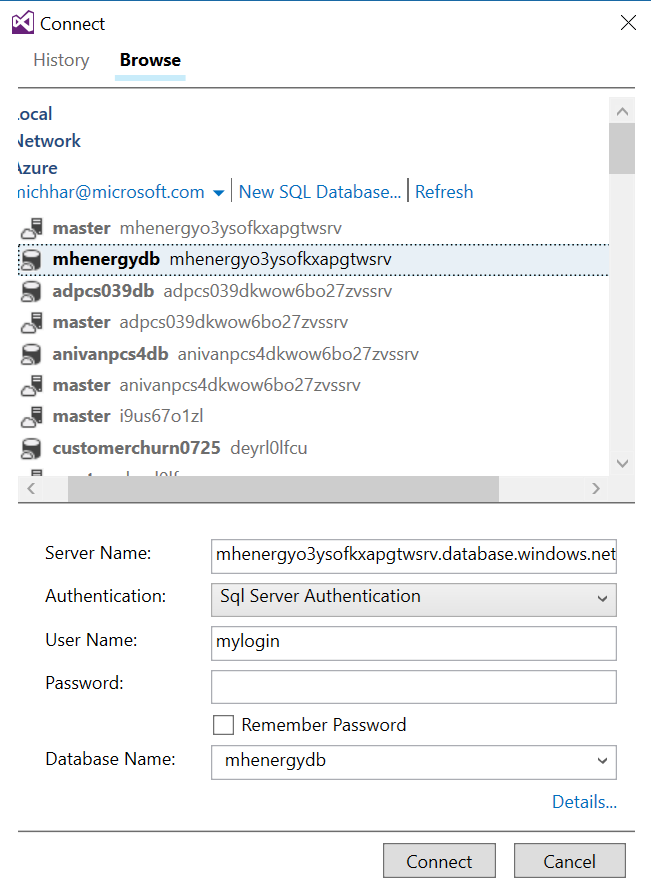

### Connect to your database in Visual Studio

*NOTE:*  You will need Visual Studio 2015 and SQL Server Data Tools and this should have been done in the pre-requisites (these instructions were [here](https://github.com/michhar/data-pipeline-education/blob/master/PREREQUISITES.md) in No. 3)

* To setup your datbase connection to begin the lab, please follow the directions [here](https://msdn.microsoft.com/en-us/library/hh272693(v=vs.103).aspx).

*NOTE:* that you may need to **turn on Encryption** as described in [this article](https://msdn.microsoft.com/library/dn948096.aspx) as well as **Allow your ip** to access the database (this is more easily done in the classic portal at https://manage.windowsazure.com).

* Use the SQL Server name from the Azure portal and the SQL Database name within that s
* In Visual Studio from the instructions above you will have browsed for the Azure SQL Database by going to "Browse" and expanding "Azure" to find it.
* When the proper database in the list under "Azure" is selected, the proper fields will be entered and you should only need enter your password, as in this screenshot: 

### Query from within SQL
Follow instructions here to create a new database, add tables and fields: https://msdn.microsoft.com/en-us/library/hh272695(v=vs.103).aspx
Also, try listing the tables you now have.  We will not use this database for any exercise after so you may delete it.

### Reference Data Integration

Read through this article: https://msdn.microsoft.com/en-us/library/dn266029(v=vs.103).aspx on Synchonizing your SQL database with a reference database.  Just reading through this article will be sufficient for this hands-on-lab.

### Troubleshooting the Database Connection Process

* Make sure you use server name w/o “,1433” as in the diagram/screenshot above.
* In portal make sure you:
  - Turn on Firewall (Under Server)
  - Transparent data encryption (under Database, not Server)
* In classic portal “Configure” under SQL Database -> Servers (pick your server) and Allow Client ip
* If you need to reset password use classic portal as described here: http://stackoverflow.com/questions/13790752/password-reset-for-azure-database

